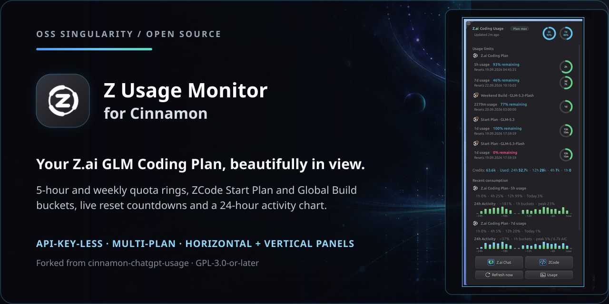
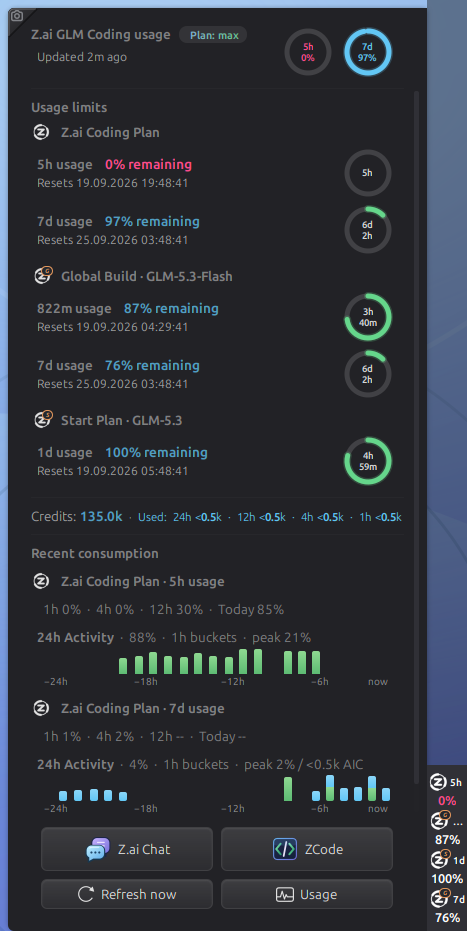
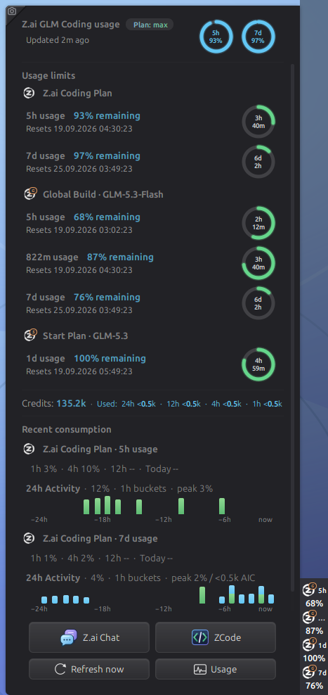
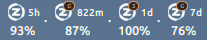
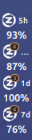
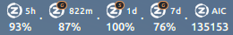
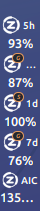
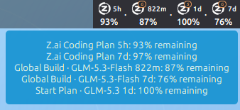
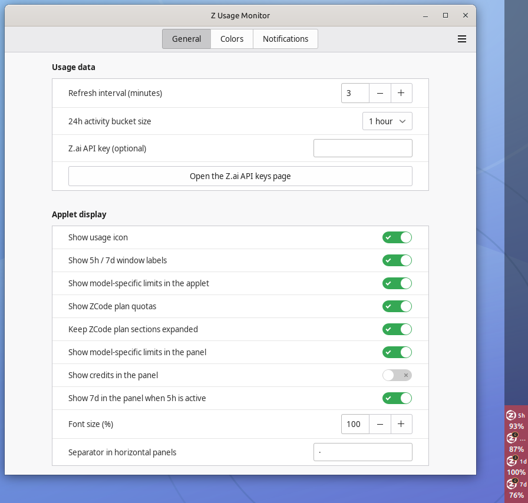
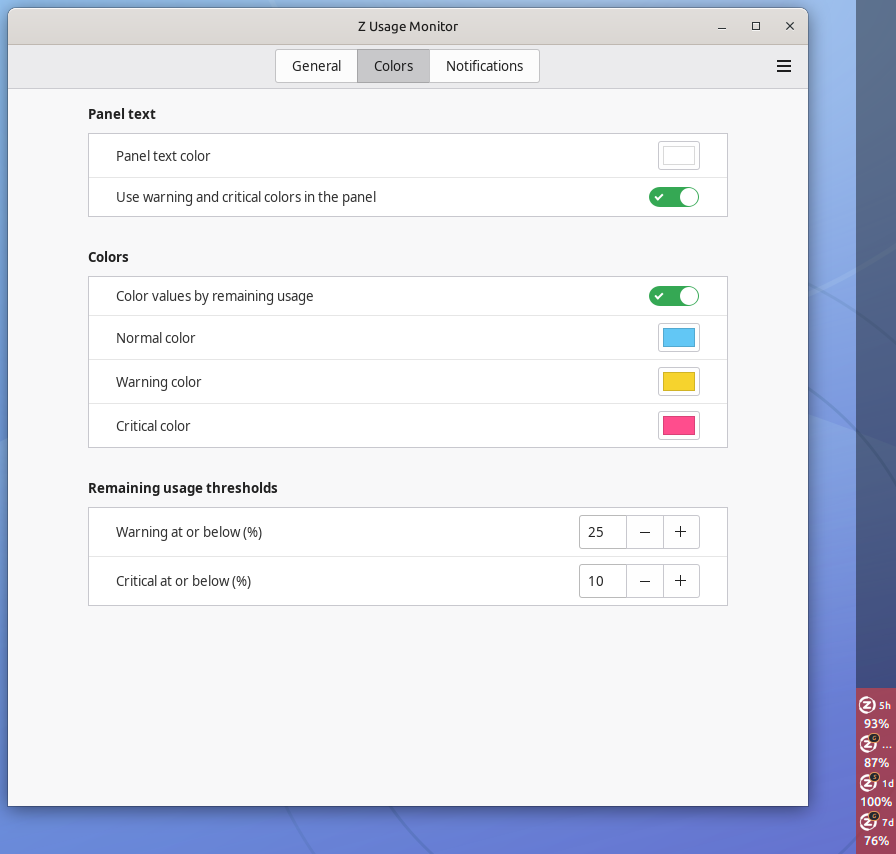

<p align="center">
  <picture>
    
  </picture>
</p>

<h1 align="center">Z Usage Monitor for Cinnamon</h1>

<p align="center">
  Keep your <strong>Z.ai GLM Coding Plan</strong> beautifully in view — right in your Cinnamon panel.
</p>

<p align="center">
  <a href="https://github.com/oss-singularity/cinnamon-z-usage/actions/workflows/check.yml"></a>
  <a href="LICENSE"></a>
  
  
</p>

<p align="center">
  
</p>

| Full usage overview with the gradient plan pill                                                 | Every window at once, including Global Build's own 5h quota                                                    |
| ----------------------------------------------------------------------------------------------- | -------------------------------------------------------------------------------------------------------------- |
|  |  |

| Horizontal top bar with all plan windows                                  | 40 px vertical panel with all plan windows                                          |
| ------------------------------------------------------------------------- | ----------------------------------------------------------------------------------- |
|  |  |

| Top bar with the credits block                                                     | Vertical panel with the credits block                                                  |
| ---------------------------------------------------------------------------------- | -------------------------------------------------------------------------------------- |
|  |  |

<p align="center"><strong>Every active quota at a glance</strong></p>
<p align="center">
  
</p>
<p align="center"><sub>Hovering the panel icon summarizes every plan window with its remaining quota.</sub></p>

| General settings                                                                                  | Colors and thresholds                                                                        |
| ------------------------------------------------------------------------------------------------- | -------------------------------------------------------------------------------------------- |
|  |  |

## Why you will love it

- **Everything at a glance** — 5-hour and weekly quota windows as rings in the
  panel and the popup, with live reset countdowns.
- **All your plans, stacked** — the personal Coding Plan _plus_ the ZCode Start
  Plan and Global Build token buckets, each with its own collapsible section.
- **API-key-less by default** — no setup: the applet reuses the credentials of
  your signed-in ZCode app. It only performs read-only GET requests against
  `https://api.z.ai`.
- **Built for real panels** — horizontal and vertical panels, threshold
  colors, pinned header and action footer, and a scrollable popup that never
  lets content escape.
- **Sticky chrome** — title, quota rings and the action buttons stay visible
  while the details scroll beneath them.

## Installation

```bash
./install.sh
```

Then enable _Z Usage Monitor_ via _System Settings → Applets_ and add it to a
panel. Requires Python 3.10+ and Cinnamon 5.8 or newer.

**Credentials:** nothing to configure if the ZCode app is signed in — the
applet picks up its Coding Plan API key automatically. Optional overrides:
the _Z.ai API key_ setting, the `ZAI_API_KEY` environment variable, or the
file `~/.config/cinnamon-z-usage/api-key`.

## The popup

| Zone               | What you get                                                                                  |
| ------------------ | --------------------------------------------------------------------------------------------- |
| Header (pinned)    | Title, the gradient plan pill, the last-update stamp and the 5h / 7d quota rings              |
| Usage limits       | Coding Plan 5h/7d plus ZCode Start Plan and Global Build sections, each with reset countdowns |
| Credits            | Remaining credits plus the "Used:" line with 24h/12h/4h/1h consumption tokens                 |
| Recent consumption | Per-plan 1h/4h/12h/Today summaries and the 24-hour activity charts                            |
| Footer (pinned)    | Z.ai Chat, ZCode, Refresh now, Usage dashboard                                                |

## Links

- **Development, architecture and the fork/backport guide:** [docs/README.md](docs/README.md)
- **Sibling applet:** [cinnamon-chatgpt-usage](https://github.com/oss-singularity/cinnamon-chatgpt-usage) (ChatGPT Work & Codex)

## Credits

Built with love by Claudiu & ZCode as part of
[OSS Singularity](https://github.com/oss-singularity). Forked from
[cinnamon-chatgpt-usage](https://github.com/oss-singularity/cinnamon-chatgpt-usage)
by Claudiu & Codex. All bundled icons are original OSS Singularity artwork
(GPL-3.0-or-later) except the bundled symbolic action icons from
[Ubuntu Yaru](https://github.com/ubuntu/yaru); see `icons/ATTRIBUTION.md`.

Licensed under [GPL-3.0-or-later](LICENSE).
