<p align="center">
  <picture>
    
  </picture>
</p>

<h1 align="center">ChatGPT Usage Monitor for Cinnamon</h1>

<p align="center">
  Keep ChatGPT Work, Codex and Codex Spark usage beautifully in view — right in
  your Cinnamon panel.
</p>

<p align="center">
  <a href="https://github.com/oss-singularity/cinnamon-chatgpt-usage/actions/workflows/check.yml"></a>
  <a href="LICENSE"></a>
  
  
</p>


## See it in action

| Common Codex-only two-window details                                                                                                   | AIC balance in the detailed usage view                                                                                  |
| -------------------------------------------------------------------------------------------------------------------------------------- | ----------------------------------------------------------------------------------------------------------------------- |
| 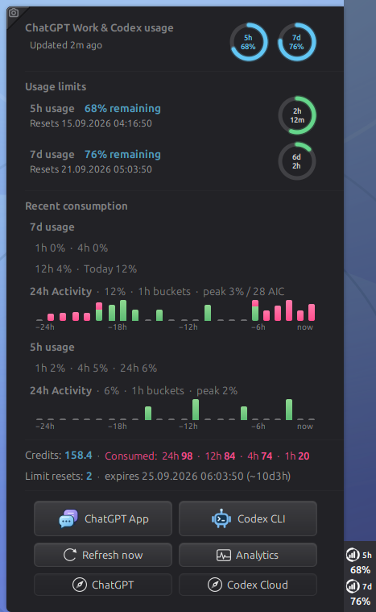 | 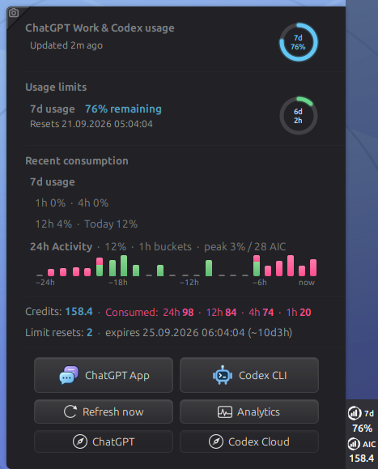 |

<p align="center"><sub>The opt-in AIC balance is also included in the detailed usage view, while the quota and activity sections remain unchanged.</sub></p>

| Panel state               | Horizontal panel                                                                                               | 40 px vertical panel                                                                                                 |
| ------------------------- | -------------------------------------------------------------------------------------------------------------- | -------------------------------------------------------------------------------------------------------------------- |
| Common Codex-only 5h + 7d | 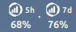        | 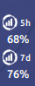        |
| Default Codex 7d          |           |           |
| Codex 7d + Spark          | 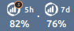     | 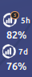       |
| Optional AIC + Codex 7d   | 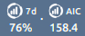 | 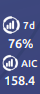 |

<p align="center"><sub>Typical Plus and standard Business accounts use the common two-window state; the 5x Business variant is separate. The compact default keeps only account-wide Codex 7d, while the AIC row requires <em>Show credits in the panel</em> and places our usage icon before the balance.</sub></p>

| Usage overview                                                                                          | Spark quotas and recent activity                                                                                                            |
| ------------------------------------------------------------------------------------------------------- | ------------------------------------------------------------------------------------------------------------------------------------------- |
| 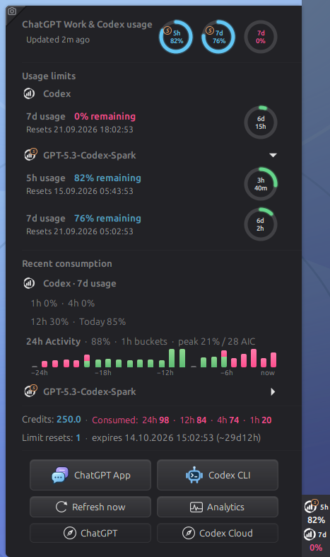 | 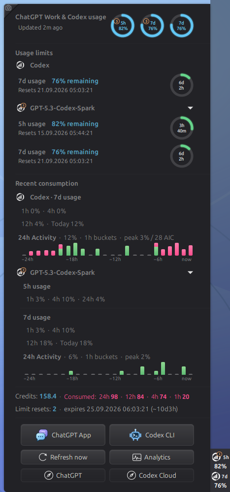 |

<p align="center"><sub>Native horizontal and vertical layouts keep the panel indicators visible as a visual anchor while the popup expands to show the details.</sub></p>

| Default overview on a horizontal panel                                                                                                   | Conditional four-ring quota state                                                                                                                                   |
| ---------------------------------------------------------------------------------------------------------------------------------------- | ------------------------------------------------------------------------------------------------------------------------------------------------------------------- |
| 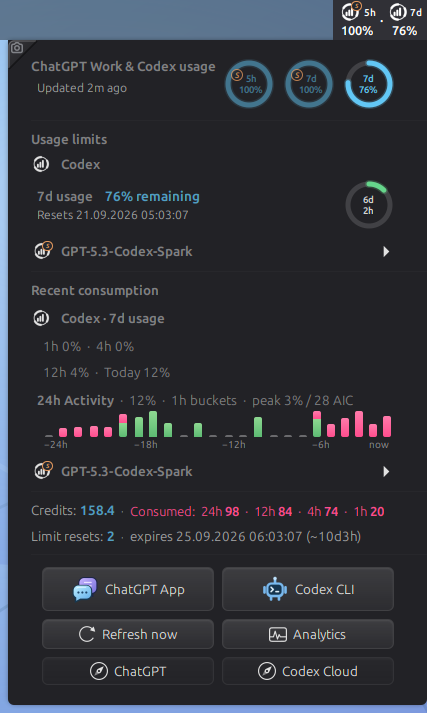 | 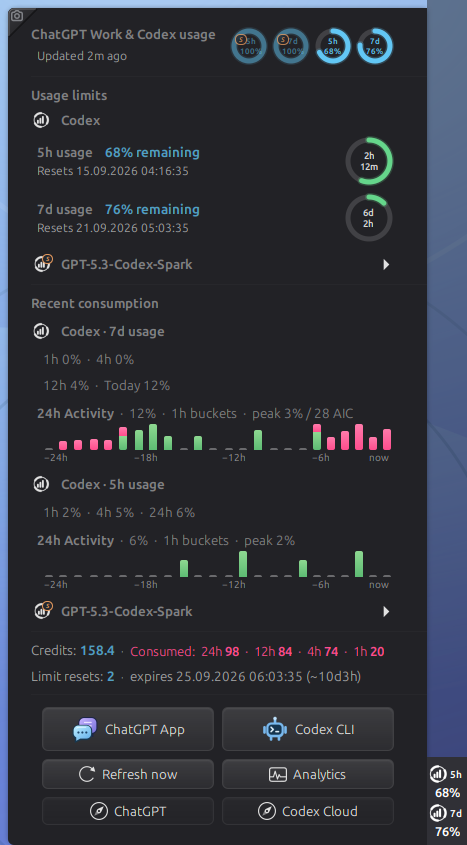 |

<table>
  <tr style="background-color: transparent;">
    <td rowspan="2" align="center" valign="top">
      <strong>Precise hourly bucket details</strong><br>
      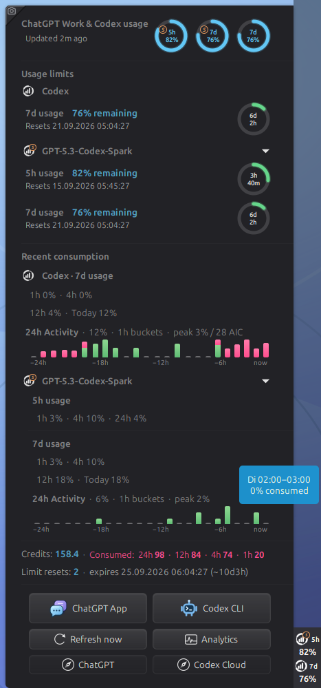
    </td>
    <td align="center" valign="top">
      <strong>Explicit earned-reset confirmation</strong><br>
      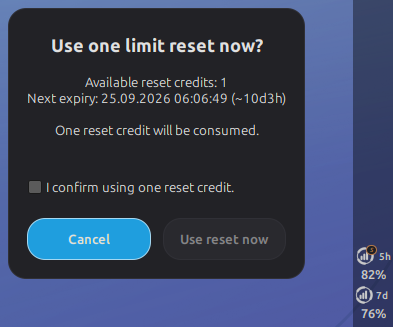
    </td>
  </tr>
  <tr style="background-color: transparent;">
    <td align="center" valign="top">
      <strong>Every active quota at a glance</strong><br>
      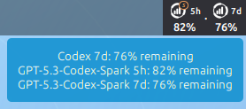
    </td>
  </tr>
</table>

| ChatGPT desktop app guidance                                                                                        | Codex CLI guidance                                                                                              |
| ------------------------------------------------------------------------------------------------------------------- | --------------------------------------------------------------------------------------------------------------- |
| 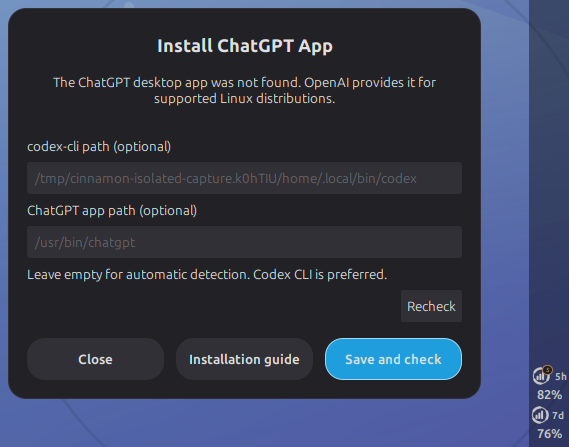 | 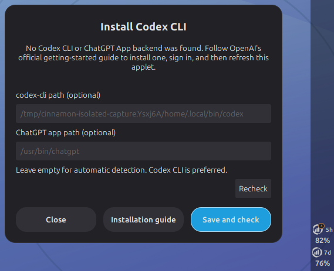 |

| General settings with model-specific panel limits enabled                                            | Colors and thresholds beside both model-specific panel indicators                                    |
| ---------------------------------------------------------------------------------------------------- | ---------------------------------------------------------------------------------------------------- |
| 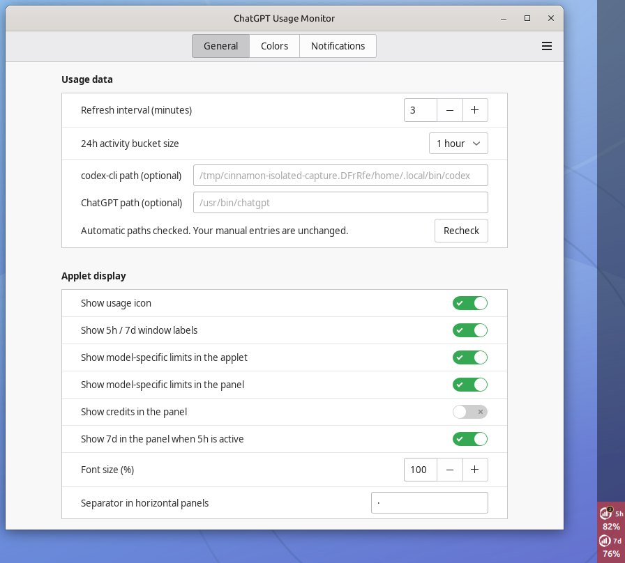 | 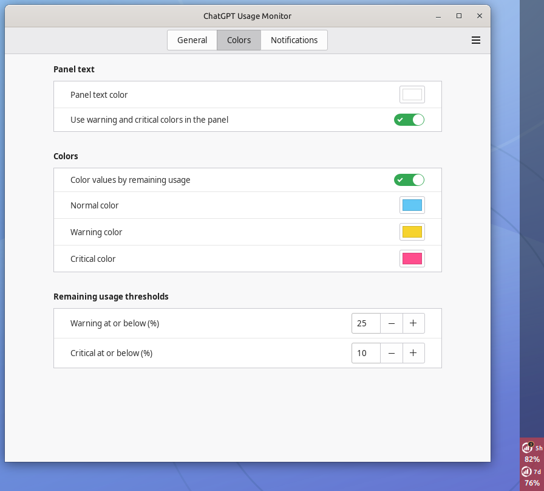 |

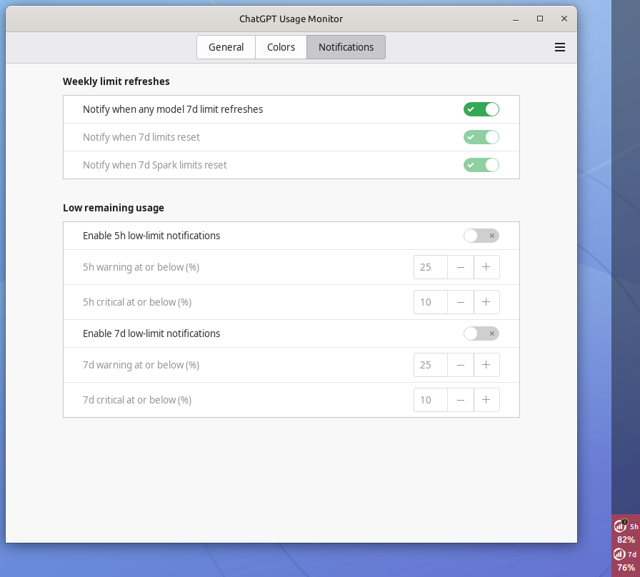

## Why it feels at home

- Live remaining usage, reset countdowns, credits and earned-reset status in a
  compact native Cinnamon popup.
- Clear 5h and 7d rings, observed 24-hour activity, hourly bucket details and
  helpful reset tooltips.
- Automatic Codex Spark discovery with an uncluttered default that can show only
  the account-wide Codex 7d indicator in the panel.
- Optional compact AIC credit-balance display beside the panel quota indicators.
- One polished layout for horizontal panels and real 40 px vertical panels,
  with configurable colors, thresholds, labels and text size.
- Native ChatGPT App and Codex CLI launch guidance, configurable backend paths,
  notifications and a Copy Screenshot action.
- Local-first by design: no browser scraping, API key, hosted account service,
  prompt storage or background daemon.

## Get started

```bash
git clone https://github.com/oss-singularity/cinnamon-chatgpt-usage.git
cd cinnamon-chatgpt-usage
./install.sh
```

Then open **System Settings → Applets** and add **ChatGPT Usage Monitor** to a
panel. Use a signed-in Codex CLI or a supported ChatGPT desktop app as the local
backend; the applet does not install either product.

## Documentation

The [technical documentation hub](docs/README.md) contains backend and settings
details, privacy boundaries, testing and capture reproduction, package
validation, release receipts and the Cinnamon Spices handoff.

Useful entry points:

- [Technical and maintainer documentation](docs/README.md)
- [Security policy](SECURITY.md)
- [Attribution](ATTRIBUTION.md) and [icon notices](icons/ATTRIBUTION.md)
- [License](LICENSE)

## Trust and attribution

The applet talks to the user's locally installed Codex app-server and stores
only the small local history needed for its charts. Credentials and prompts are
never read or bundled. Earned resets always require an explicit confirmation.

Made with love by Claudiu & Codex. 🩷

Licensed under GPL-3.0-or-later. OpenAI, ChatGPT and Codex are trademarks of
OpenAI; this independent community project is not affiliated with or endorsed
by OpenAI.
